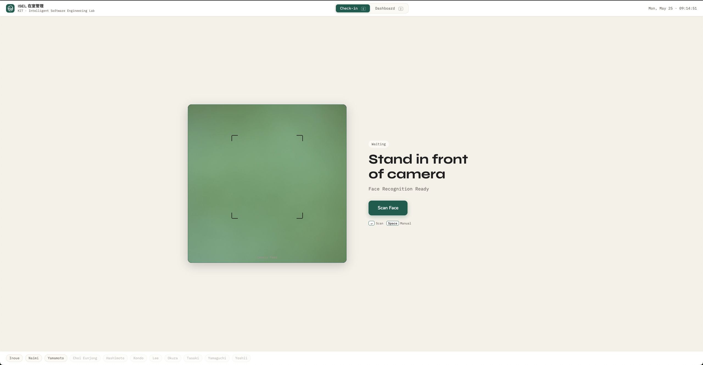
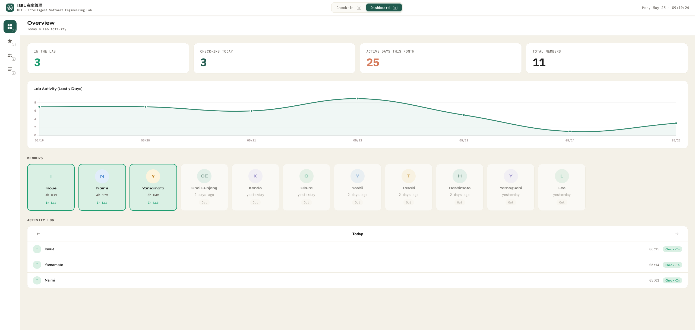
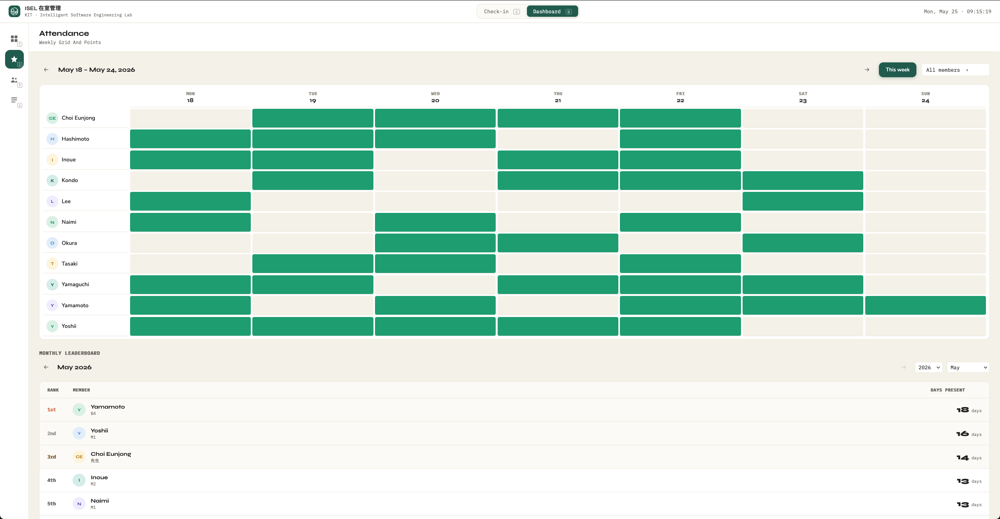

# ISEL 在室管理システム

> Face-recognition lab presence tracking for the Intelligent Software Engineering Lab (KIT).

Members check in and out by looking at a camera at the lab door. Everyone can see a live dashboard, a weekly attendance grid, adn monthly/academic-year leaderboards, and Admin can review a full audit trail. A Slack integration keeps the lab Slack channel up to date with who is in.

---

## Table of Contents

- [Screenshots](#screenshots)
- [Features](#features)
- [Tech Stack](#tech-stack)
- [Quick Start](#quick-start)
- [Basic Usage](#basic-usage)
- [Configuration](#configuration)
- [Slack Setup](#slack-setup)
- [Project Layout](#project-layout)
- [Testing](#testing)
- [Documentation](#documentation)
- [Contributing](#contributing)
- [License](#license)
- [Acknowledgments](#acknowledgments)

---

## Screenshots

- **Check-in screen.** 



- **Dashboard overview.** 


- **Attendance tab.**


---

## Features

- **Face check-in and check-out** with a 3-variant capture system (normal, glasses, mask). Glasses on vs glasses off does not trip up the match.
- **Weekly attendance grid** in the GitHub-style heat-map. Shows who came in on which day.
- **Leaderboards.** One point per day present. Browse by month or by academic year (`2026年度`). The all-time count resets every April 1.
- **Member management.** Add, edit, delete, re-register faces. A Promotion Wizard walks the admin through grade transitions each April.
- **Audit log.** Every admin and attendance event is recorded. Filter by member, action, date, or free text. Export to CSV.
- **Slack daily status board + `/who` and `/points` slash commands.** One Block Kit message per day in your lab channel, edited in place as people come and go (no chat firehose). Anyone in the workspace can run `/who` for the current present-list or `/points` for the top 5 of this month's leaderboard, both ephemeral.
- **Auto-checkout scheduler.** A nightly in-app job at `DAY_RESET_HOUR` (Asia/Tokyo) force-closes any forgotten sessions.
- **Manual fallback.** When face recognition fails, anyone can pick their name from a list.

---

## Tech Stack

| Layer | Choice |
|---|---|
| Language | Python 3.10+ |
| Web framework | Flask 3 |
| ORM / DB | SQLAlchemy 2.0, SQLite (dev), MySQL (prod) |
| Face recognition | DeepFace + ArcFace (512-dim embeddings, cosine distance) |
| Image processing | OpenCV 4, NumPy, SciPy |
| Frontend | Vanilla JavaScript (no build step, no framework) |
| Charts | Chart.js 4 |
| Fonts | Syne, Nunito, IBM Plex Mono |
| Slack | slack-bolt (Socket Mode, Block Kit messages, `/who` + `/points` slash commands) |

---

## Quick Start

Tested on macOS and Linux (Ubuntu). Windows native should work but is untested.

### Prerequisites

- Python 3.10 or newer
- A webcam for kiosk use. The dashboard works without one.
- A Slack workspace where you can install an app and get both a bot token (`xoxb-...`) and an app-level token (`xapp-...`).

### Install

```bash
git clone https://github.com/your-org/isel_room.git
cd isel_room
python -m venv .venv
source .venv/bin/activate           # macOS/Linux
pip install -r requirements.txt
```

> The first `pip install` is slow (~3 minutes) because DeepFace pulls in TensorFlow. This is a one-time cost.

### Configure

```bash
cp .env.example .env
```

Open `.env` and set at minimum:

```env
FLASK_SECRET_KEY=<generate with: python -c "import secrets; print(secrets.token_hex(32))">
ADMIN_PIN=<choose any string>
```

Leave the rest at defaults for now.

### Seed the database

```bash
python tests/test_seed_db.py
```

This drops and recreates the DB with 11 mock members and about 60 days of fake attendance history. Re-run it any time during development to reset.

### Run

```bash
flask --app app run --host 0.0.0.0 --port 5001
```

Open <http://localhost:5001> in a browser. The Check-in screen loads by default. Press `D` to switch to the Dashboard.

> **Production:** use `wsgi.py` with gunicorn. The auto-checkout runs automatically inside the app at `DAY_RESET_HOUR` (Asia/Tokyo) — no cron needed. Run gunicorn with a **single worker** (the default), or if you scale out set `ENABLE_SCHEDULER=0` on the extra workers so only one process schedules the job. `flask auto-checkout` remains available as a manual fallback.

---

## Basic Usage

### As a lab member (at the kiosk)

1. Walk up to the camera.
2. Press `Enter` (or click **Scan Face**).
3. Confirm the match with `Enter`. The screen says "Welcome, <name>!" or "See you, <name>!".

If your face is not matched, press `Space` to pick your name from a list.

### As the sensei or admin (on the dashboard)

| Key | Tab |
|---|---|
| `1` | Overview. Stat cards, charts, recent activity. |
| `2` | Attendance. Weekly grid and leaderboards. |
| `3` | Members. Add, edit, delete, re-register (PIN required). |
| `4` | Activity Log. Full audit log with filters (PIN required). |

**Add a new member:** Members tab → Add Member → enter name and role → 3-step face capture wizard. Normal is required. Glasses and Mask are optional. The wizard bursts 3 frames per step for robustness.

**Promote students at year-end:** Members tab → Promote Students → walk through each student in the wizard and pick their new role (M1 → M2, M2 → 卒業 or PhD, and so on). All changes are applied atomically and logged.

### Nightly auto-checkout

This runs automatically inside the app — an in-process scheduler fires at `DAY_RESET_HOUR:00` **Asia/Tokyo** every night and force-closes any forgotten sessions. No crontab setup is required. On startup the app logs `Auto-checkout scheduler started`.

To force a checkout manually (or if you've disabled the scheduler), use the CLI fallback:

```bash
FLASK_APP="app:create_app" flask auto-checkout
```

If the scheduler ever misses a tick, no big deal. Any session open for more than 24 hours is closed automatically on the user's next check-in.

---

## Configuration

All configuration is via environment variables, loaded from `.env`:

| Variable | Default | Required? | Purpose |
|---|---|---|---|
| `FLASK_SECRET_KEY` | `dev-secret-change-me` | **Yes in prod** | Flask session signing key |
| `ADMIN_PIN` | _(empty)_ | **Yes** | PIN for the admin dashboard |
| `SLACK_BOT_TOKEN` | _(empty)_ | **Yes in prod** | Bot token (`xoxb-...`) for posting + editing the status board |
| `SLACK_APP_TOKEN` | _(empty)_ | **Yes in prod** | App-level token (`xapp-...`) for Socket Mode (slash commands) |
| `SLACK_CHANNEL` | `#a-lab-status` | No | Channel where the daily status board is posted |
| `DATABASE_URL` | `sqlite:///isel_room.db` | No | SQLAlchemy connection string |
| `LOW_CONFIDENCE_THRESHOLD` | `0.40` | No | UI badge cutoff for low-confidence matches (cosmetic only) |
| `DAY_RESET_HOUR` | `22` | No | Hour (Asia/Tokyo) the in-app scheduler runs the nightly auto-checkout |
| `ENABLE_SCHEDULER` | `1` | No | Set `0` to disable the in-app auto-checkout scheduler (e.g. on extra gunicorn workers) |

`ProdConfig` (used by `wsgi.py`) refuses to start if any of `FLASK_SECRET_KEY`, `ADMIN_PIN`, `SLACK_BOT_TOKEN`, or `SLACK_APP_TOKEN` is missing. In dev the Slack tokens are still optional; the integration disables itself with a warning and the rest of the app runs normally.

---

## Slack

The integration does two things:

- **Daily status board.** One Block Kit message per day in the channel we choose (`SLACK_CHANNEL`, default `#a-lab-status`), edited in place via `chat.update` as people come and go. No chat firehose.
- **`/who` and `/points` slash commands.** Anyone in the workspace can run `/who` for an ephemeral present-list, or `/points` for the top 5 of this month's leaderboard (medals on the top three). Replies are ephemeral, so they don't clutter the channel.


## Project Layout

```
isel_room/
├── app.py                  # Flask app factory
├── wsgi.py                 # Production entry point
├── config.py               # Dev / Prod / Test configs
├── prod_seed_db.py              # Reset DB with mock data
├── isel/
│   ├── api/                # Flask blueprints (auth, attendance, users, stats, admin)
│   ├── services/           # Business logic (attendance, users, points, stats, audit)
│   ├── db/                 # SQLAlchemy models + session_scope context manager
│   ├── face_engine.py      # DeepFace ArcFace wrapper
│   ├── integrations/       # Slack status board
│   └── utils.py            # @admin_required, decode_image, ok()/fail() helpers
├── tests/                  # pytest suite
└── ui/
    ├── index.html          # Single-page shell
    ├── css/                # tokens, base, checkin, dashboard
    └── js/                 # core, checkin, dashboard
```

See [ISEL_ROOM_GUIDE.md §3](ISEL_ROOM_GUIDE.md#3-repository-layout) for the annotated tree.

---

## Testing

```bash
python -m pytest
```

Runs the full suite (~19 tests) against an in-memory SQLite. No external services required.

---

## Documentation

For everything beyond getting it running:

- **[ISEL_ROOM_GUIDE.md](ISEL_ROOM_GUIDE.md).** Comprehensive architecture. Every layer explained. Face pipeline deep-dive. Frontend module map. State machines. Testing patterns. Common workflows (recipes). Troubleshooting. Read this on your first day.

---

## Contributing

We follow [Conventional Commits](https://www.conventionalcommits.org/):

```
feat(points): academic-year leaderboard resets every Apr 1
fix(ui): rotate avatar colours in kiosk manual picker
refactor(slack): single daily status board updated via chat.update
chore(seed): update members to actual lab roster
docs(guide): document 3-variant face slot system
```

Subject in lowercase, no trailing period. Body optional, wrapped at 72.

---

## License

_Internal use, KIT Intelligent Software Engineering Lab._

---

## Acknowledgments

- Built for the **ISEL Lab** at the Kyoto Institute of Technology.
